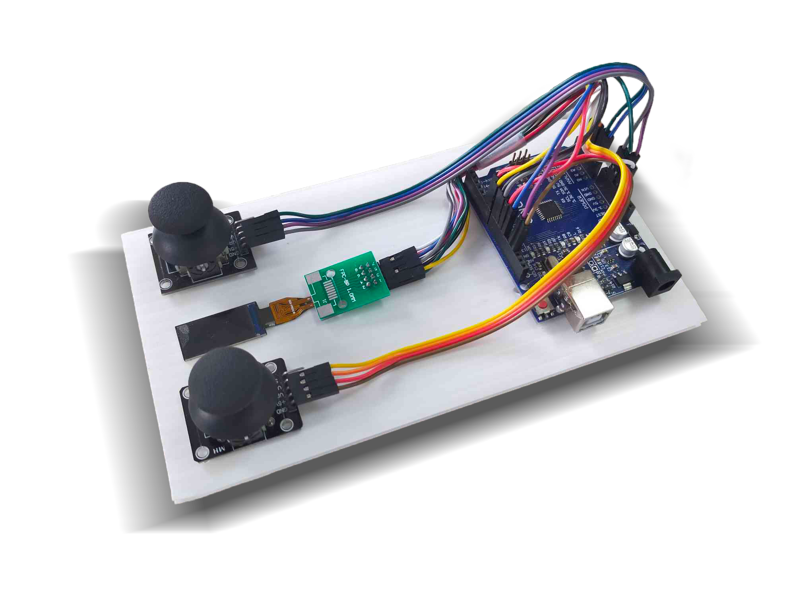
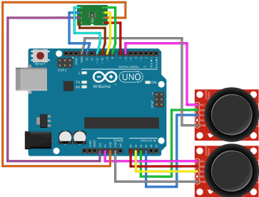

# Air Hockey

An Arduino UNO game

## Description

Air Hocky is a game where two players play against each other. The game is played on a table with a puck, two mallets and a goal on each side. The goal of the game is to score points by hitting the puck into the opponent's goal. The player with the highest score at the end of the game wins.

This project is a school final project. We were forced to do this.

## Ingredients
* Arduino Uno (R3, other boards will also work)
* Joystick x2
* ST7735S LCD screen (0.96 inch 180x60 TFT)
* DuPont line x16
* USB line (power supply/code transmission)

## Installation

Please install `Adafruit_ST7735.h` and `Adafruit_GFX.h` before compiling the code.

## Circuit Diagram

> 1~8 is the pin number of my TFT display. You can change it to your own pin number. I use pin six as the power supply of the joystick. You can also change it to your own pin number, but you need to change the code. Using pin 12 may let the line looks better, but my pin 12 can't output 5V, so I use pin 6.

| PIN | SYMBOL |
| --- | --- |
| 1 | LEDA |
| 2 | GND |
| 3 | RESET |
| 4 | CS |
| 5 | SDA |
| 6 | SCL |
| 7 | VDD |
| 8 | CS |

## How to play?

When powered, the screen will display an opening animation. After the animation, the game will start when both of the joystick push foward (The screen will guide the direction). The game will end when a player scores 3 points. The screen will display the winner, and the game will restart.

## Code Flow

## Programming languages used:
 

## Author

* [Edit Mr.](https://github.com/Edit-Mr/)
* [yukaichao1029](https://github.com/yukaichao1029)
* [YanYi0222](https://github.com/YanYi0222)
